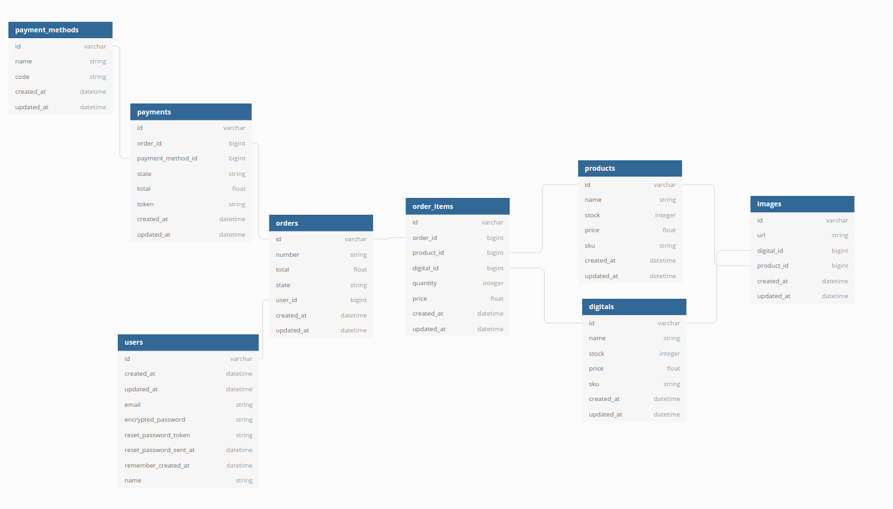

# Desafio Catalogo y pago

## Imagenes de catálogo:
Se utiliza poliformismo para poder asociar las imagenes al catálogo.
Se permite solo una url para los productos digitales. Los productos físicos no tienen límite de urls a asociar.

El esquema relacional del proyecto se distribuye de la siguiente manera:



La relación a imágenes está hecha mediante exclusive arc a modo  de permitir solo un tipo se asociación por imagen.
Se utiliza un mecanismo similar para order_items, de forma que solo permita que cada registro tenga o un producto digital o un producto físico asociado.

## Animales (Parte II)
Concepto inicial: El poliformismo en rails es ideal para generar relaciones de una clase con múltiples modelos que la requieren. A esto se le llama una relación polimorfica

### Ejemplo
Asumiremos la clase Animal con el atributo name que constituye la relación polimorfica con las clases Dog, Cat y Cow. Los tres modelos poseen sus particularidades pero todos pertenecen a la clase Animal.

Para llevar a cabo esta relación polimorfica debemos definir los modelos de la siguente manera:

#### Creación de modelos

- Modelos relacionados (Dog, Cat y Cow): 
```
    rails g model dog some_attribute:string
```
**Nota:** los ejemplos serán mostrados solo para el moldeo Dog, pero se deben ejecutar los mismos pasos para Cat y Cow.

- Modelo Poliomorfico (Animals): 
```
    rails g model animals name animalable:references{polymorphic}
```
**Nota:** la terminación "able" es una convención en Rails para las relaciones polimorficas.  

La referencia polimorfica creará en la tabla Animals los atributos:
- animalable_type: Referencia al modelo del registro relacionado
- animalable_id: Referencia al registro del modelo relacionado
**Nota:** notar que la combinación de ambas generan una "super clave" que permite rastrear de que ID y tabla se trata.


#### Configuración de las Clases
- Modelos relacionados
```
Class Dog 
    has_one :animal, as :animalable
end
```
**Nota:** En este ejemplo se utilizaron solo relaciones "has_one" por la naturaleza de la data, sin embargo se puede aplicar con relaciones "has_many" en caso de poder tener varios relaciones con el modelo Polimorfico.  

- Modelo Polimorfico
```
Class Animal 
    belongs_to :animalable, polymorphic: true
end
```

#### Crear registros

- Modelos relacionados
```
dog1 = Dog.create(some_attribute: value)
cat1 = Cat.create(some_attribute: value, other_attribute: value)
```

- Modelo polimorfico
```
animal1 = Animal.create(name: "Coraje", animalable: dog1)
animal2 = Animal.create(name: "Nyan Cat", animalable: cat1)
```

De esta manera los atributos de los registros polimorficos serán serán:

animal1:
- name: "Nina"
- animalable_type: "Dog"
- animalable_id: "1"

animal2:
- name: "Nyan Cat"
- animalable_type: "Cat"
- animalable_id: "1"

Lo que se interpreta que el registro de la tabla Animal "animal1" se relaciona con el registro de la tabla "Dog" con id = 1. A su vez el registro de la tabla Animal "animal2" se relaciona con el registro de la tabla "Cat" con id = 1

Es importante notar que no habrá conflicto de ID, ya que son el id 1 de dos tablas distintas.
